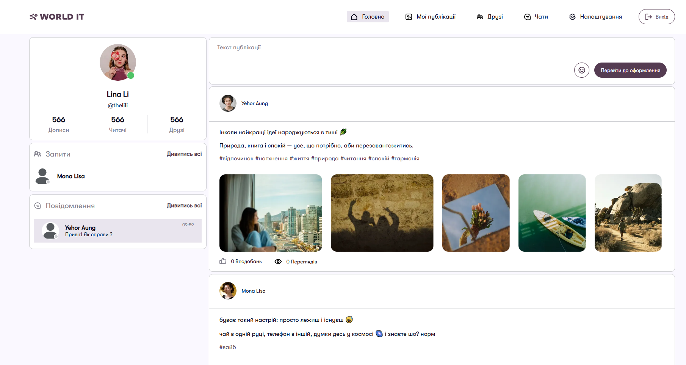
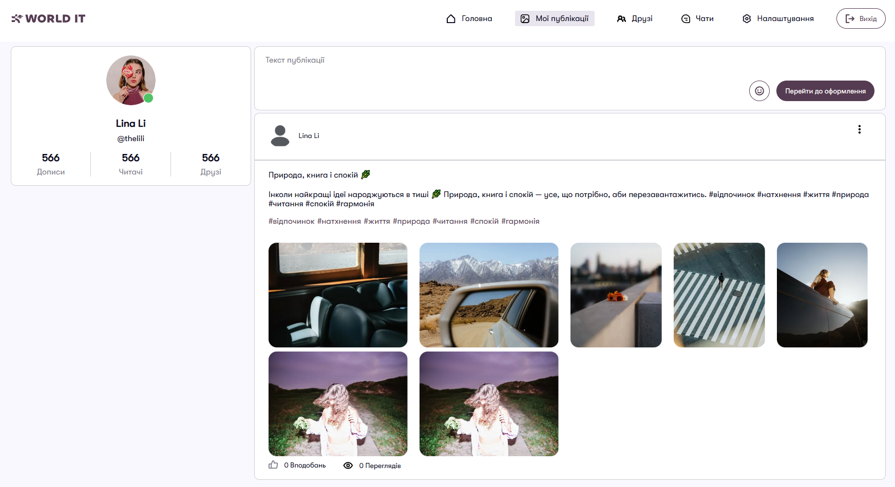
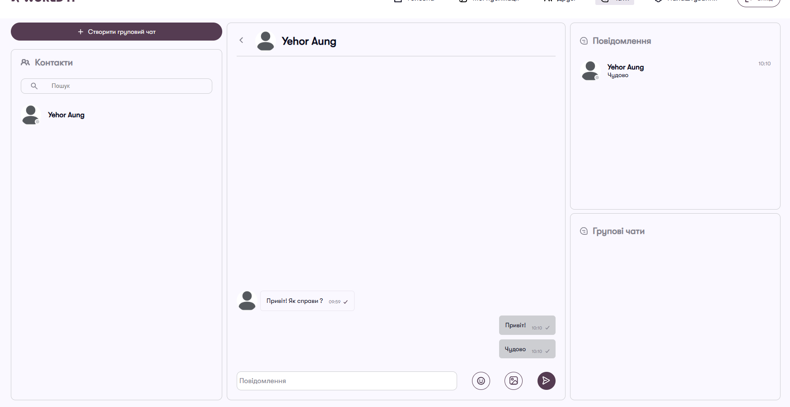

<div align="center">

# WITnetwork Frontend

🇬🇧 English | [🇺🇦 Українська](#українська)

</div>

---

# English

## About

WITnetwork is a full-featured social networking platform with support for real-time chats, posts, photo albums, a friends system, and many other features. The project was created as a large educational project to explore a modern technology stack, apply software architecture principles, and strengthen practical Full Stack development skills.

## Features

- 🔐 Authentication & Authorization
- 👤 User Profiles
- 📝 Create Posts
- 💬 Real-time Chats
- 👥 Groups
- 🖼️ Photo Albums
- 🤝 Friends System
- 🔔 Notifications
- 📱 Responsive Interface

## Tech Stack

### Frontend

- React
- TypeScript
- React Router
- Zustand
- Socket.IO
- SignalR
- CSS Modules

### Tools

- ESLint
- Prettier

## Project Structure

```text
src/
├── app/
├── assets/
├── constants/
├── entities/
├── features/
├── hooks/
├── pages/
├── shared/
├── types/
└── widgets/
```

## Installation

```bash
git clone https://github.com/Nazar-Zozulya/w-it-messanger-front.git

npm install
```

## Environment Variables

Copy the `.env.dist` file and rename it to `.env`:

```bash
cp .env.dist .env
```

Then modify the environment variables if necessary.

```env
REACT_APP_USER_SERVICE_URL=http://localhost:8001
REACT_APP_POST_SERVICE_URL=http://localhost:8002
REACT_APP_CHAT_SERVICE_URL=http://localhost:8003
REACT_APP_CSHARP_BACKEND_URL=http://localhost:5028
REACT_APP_WHICH_BACKEND=js or csharp
```

## Run

### Development

```bash
npm start
```

### Development (Docker / WSL)

```bash
npm run start-watch
```

### Build

```bash
npm run build
```

### Run Tests

```bash
npm test
```

### Build Docker Image

```bash
npm run docker:build
```

### Run Docker Container

```bash
npm run docker:run
```

## Screenshots

### Home



### Profile



### Chat



## API

The backend must be running separately.

## Requirements

- Node.js 20+
- npm 10+

## Author

Nazar Zozulya

## License

MIT

---

# Українська

## Про проєкт

WITnetwork — це повноцінна соціальна мережа з функціоналом чатів, публікацій, альбомів, системою друзів та іншими можливостями. Проєкт створений як великий навчальний проєкт для опанування сучасного стеку технологій, застосування архітектурних підходів та закріплення практичних навичок повноцінної Full Stack-розробки.

## Можливості

- 🔐 Автентифікація та авторизація
- 👤 Профілі користувачів
- 📝 Створення публікацій
- 💬 Чати в реальному часі
- 👥 Групи
- 🖼️ Фотоальбоми
- 🤝 Система друзів
- 🔔 Сповіщення
- 📱 Адаптивний інтерфейс

## Стек технологій

### Frontend

- React
- TypeScript
- React Router
- Zustand
- Socket.IO
- SignalR
- CSS Modules

### Інструменти

- ESLint
- Prettier

## Структура проєкту

```text
src/
├── app/
├── assets/
├── constants/
├── entities/
├── features/
├── hooks/
├── pages/
├── shared/
├── types/
└── widgets/
```

## Встановлення

```bash
git clone https://github.com/Nazar-Zozulya/w-it-messanger-front.git

npm install
```

## Змінні середовища

Скопіюйте файл `.env.dist` та перейменуйте його на `.env`:

```bash
cp .env.dist .env
```

Після цього за потреби змініть значення змінних середовища.

```
REACT_APP_USER_SERVICE_URL=http://localhost:8001
REACT_APP_POST_SERVICE_URL=http://localhost:8002
REACT_APP_CHAT_SERVICE_URL=http://localhost:8003
REACT_APP_CSHARP_BACKEND_URL=http://localhost:5028
REACT_APP_WHICH_BACKEND=js or csharp
```

## Запуск

### Режим розробки

```bash
npm start
```

### Режим розробки (Docker / WSL)

```bash
npm run start-watch
```

### Збірка проєкту

```bash
npm run build
```

### Запуск тестів

```bash
npm test
```

### Створення Docker-образу

```bash
npm run docker:build
```

### Запуск Docker-контейнера

```bash
npm run docker:run
```

## Знімки екрана

### Головна


### Профіль


### Чат


## API

Backend має бути запущений окремо.

## Вимоги

- Node.js 20+
- npm 10+

## Автор

Назар Зозуля

## Ліцензія

MIT